# 젤다의 전설: 꿈꾸는 섬 모작

  

## 🎮 프로젝트 소개

DirectX11 기반으로 제작한 3D 액션 어드벤처 「젤다의 전설: 꿈꾸는 섬」 모작 개인 프로젝트입니다.  
원작의 주요 게임 시스템을 기반으로 새로운 스토리라인과 콘텐츠 흐름을 구성하였습니다.

NPC 대화 및 Quest 연동, Interaction, Player 행동 제어 등의 Gameplay 콘텐츠뿐만 아니라  
Stack 기반 Level 관리, Room 전환 및 캐싱, Event 처리 구조와 자체 MapTool까지 직접 구현하였습니다.

---

## 📅 개발 기간

2025.09.16 ~ 2025.12.16  
약 3개월

---

## 👨‍💻 개발 인원

개인 프로젝트 (1명)

---

## 🛠 개발 환경

### Language
- C++

### Graphics API
- DirectX 11
- HLSL

### Library / Tool
- ImGui

### Development Tool
- Visual Studio

---

## 📌 담당 구현 기능

| 구분 | 구현 내용 |
|---|---|
| Gameplay | State Pattern 기반 Player 행동 제어, NPC 대화 · Quest 연동, Interaction, Monster AI |
| Framework / Engine | Stack 기반 Level 관리, Room 전환 및 캐싱, EventBus · Invoke 기반 이벤트 처리, Animation Notify, Collision System |
| Rendering | Material, Dissolve, Minimap, Billboard Particle, Effect Rendering |
| Tool | MapTool 기반 Map · NPC · Interaction · Room · Navigation 데이터 제작 |

---

## 🎥 시연 영상

[\[YouTube 링크\]](https://youtu.be/PB9gO-fBNdo)

---

## 📷 프로젝트 이미지

|타이틀| 인게임 스크린샷 1 |
|:---:|:---:|
| 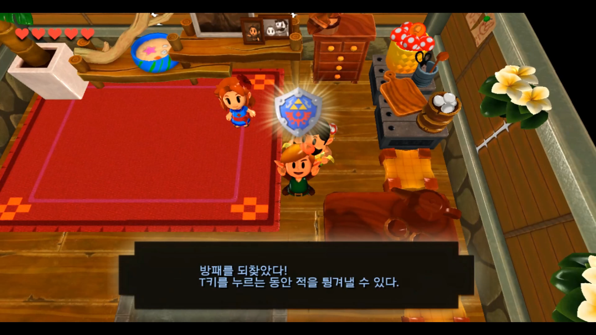 | 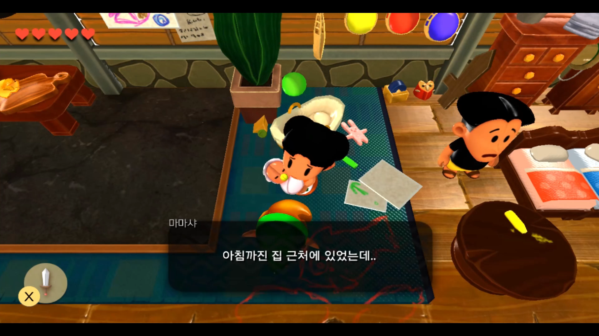 |

| 인게임 스크린샷 2 | 인게임 스크린샷 3 |
|:---:|:---:|
| 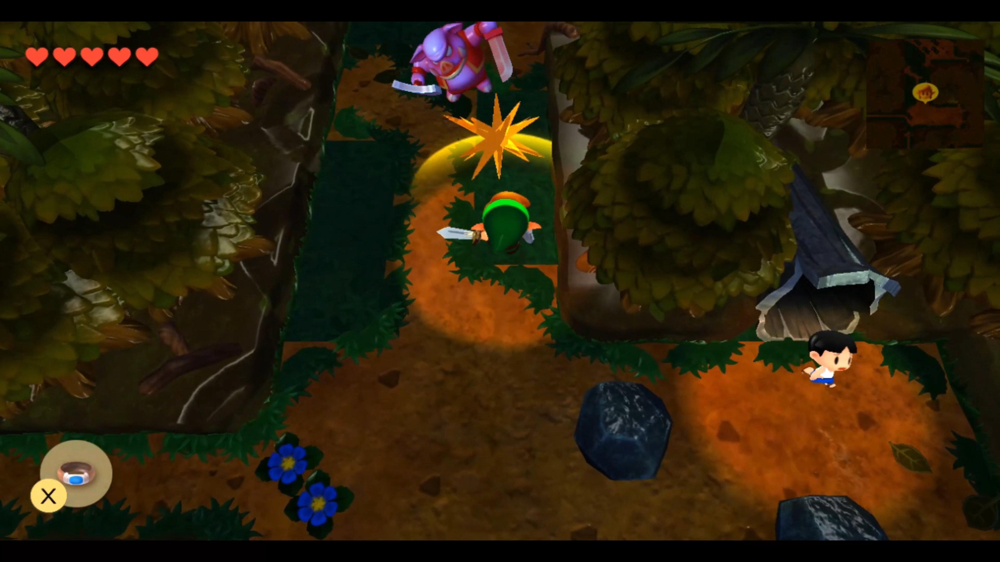 | 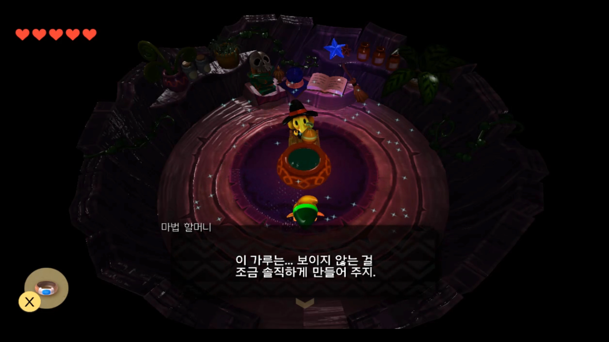 |

| 인게임 스크린샷 4 | 엔딩 |
|:---:|:---:|
| 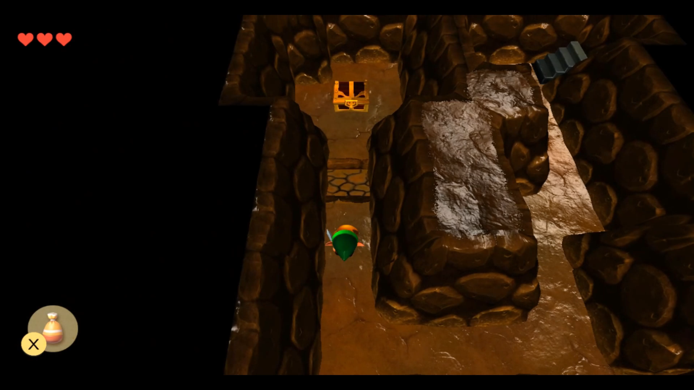 | 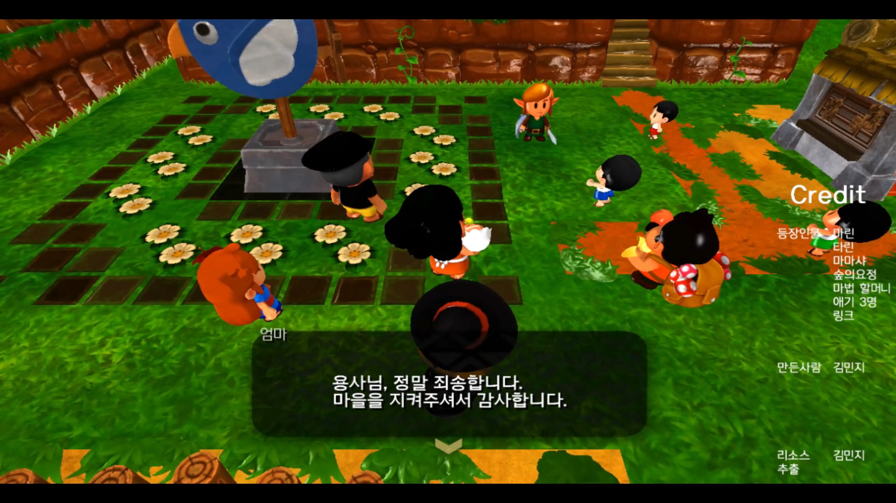 |

---

# ⭐ 주요 구현 사항

# 🧩 Gameplay / Contents

## 1. NPC 대화 및 Quest 연동 시스템

  

### 개요

JSON 기반 Dialogue 데이터와 Quest 진행 상태를 연동하여, 플레이어의 진행도에 따라 NPC의 대사와 이벤트가 변경되도록 구현했습니다.

### 주요 내용

Quest 상태와 조건을 기준으로 현재 진행도에 맞는 Dialogue를 선택하고, 각 대화 단계에 등록된 Action을 통해 Quest 진행과 Gameplay Event를 연결하도록 구성했습니다. NPC별 대화 데이터를 외부 데이터로 분리하여 새로운 대화와 Quest 흐름을 콘텐츠 데이터 중심으로 확장할 수 있도록 구현했습니다.

---

## 2. Interaction 시스템

  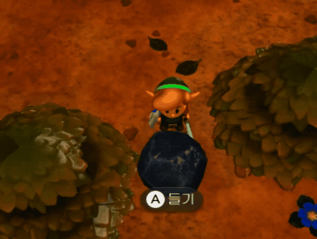

### 개요

플레이어가 NPC와 Object 등 다양한 대상과 상호작용할 수 있도록 공통 Interaction 흐름을 구현했습니다.

### 주요 내용

플레이어 주변의 상호작용 가능한 대상을 판별하고, 대상이 제공하는 Interaction 정보를 기준으로 입력과 Gameplay 동작을 연결하도록 구성했습니다. 각 Object가 자신의 상호작용 결과를 담당하도록 하여 Player가 대상별 세부 동작을 직접 판단하지 않도록 역할을 분리했습니다.

---

## 3. State Pattern 기반 Player 행동 제어

  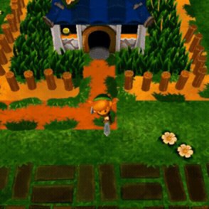

### 개요

이동, 공격, 방패, 점프 등 Player의 다양한 행동을 State 단위로 분리하여 관리하는 행동 제어 시스템을 구현했습니다.

### 주요 내용

각 State가 진입, 갱신, 종료 시점의 행동과 입력 조건을 독립적으로 처리하고, 현재 State가 종료 가능한 경우에만 다음 State로 전환하도록 구성했습니다. 행동이 증가하면서 하나의 Player 클래스에 상태 전환 로직이 집중되는 문제를 줄이고, 각 행동의 입력·Animation·이동 제어를 State별로 관리하도록 구현했습니다.

---

# ⚙️ Framework / Engine

## 1. Stack 기반 Level 관리 시스템

  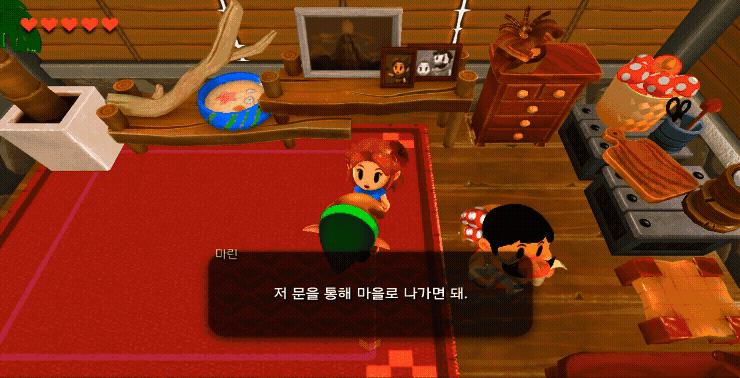

### 개요

게임 Level과 UI Level을 Stack 구조로 관리하여 기존 Level의 상태를 유지한 채 새로운 화면이나 공간을 Overlay할 수 있도록 구현했습니다.

### 주요 내용

새로운 Level이 Push되면 기존 Level을 Pause하고, Pop 시 이전 Level을 다시 Resume하도록 구성했습니다. Level의 진입·일시정지·복귀·종료 Lifecycle을 분리하여 UI Overlay, NPC Room 진입, Loading 등 서로 다른 전환 상황에서도 기존 Gameplay 상태를 유지할 수 있도록 구현했습니다.

---

## 2. 캐싱 기반 Room 전환 시스템

### 개요

하나의 Room Level 안에서 여러 실내 공간을 전환하고, 이미 생성한 Room 데이터는 재사용할 수 있도록 캐싱 기반 Room 관리 시스템을 구현했습니다.

### 주요 내용

Room 진입 시 Object, NPC, Navigation, Light 등의 데이터를 하나의 Room 단위로 구성하고, 처음 방문한 Room만 생성하여 Cache에 저장하도록 구현했습니다. 이후 동일한 Room에 재진입하면 기존 데이터를 다시 활성화하고 Player 위치와 Navigation 등의 상태를 동기화하여 불필요한 재생성을 줄였습니다.

---

## 3. EventBus · Invoke 기반 이벤트 처리

### 개요

서로 직접 참조할 필요가 없는 시스템 사이의 이벤트 전달과 지연 실행을 관리하기 위해 Event 기반 처리 구조를 구현했습니다.

### 주요 내용

EventBus를 통해 Listener가 필요한 Event를 등록하고 Publisher가 Event 이름과 데이터를 전달하도록 구성하여 시스템 사이의 직접적인 의존을 줄였습니다. 또한 일정 시간 이후 실행되어야 하는 동작은 Invoke Queue에서 별도로 관리하여 Gameplay Object가 직접 시간 상태를 보유하지 않고 예약된 동작을 실행할 수 있도록 구현했습니다.

---

# 🎨 Rendering

## 1. Effect System

  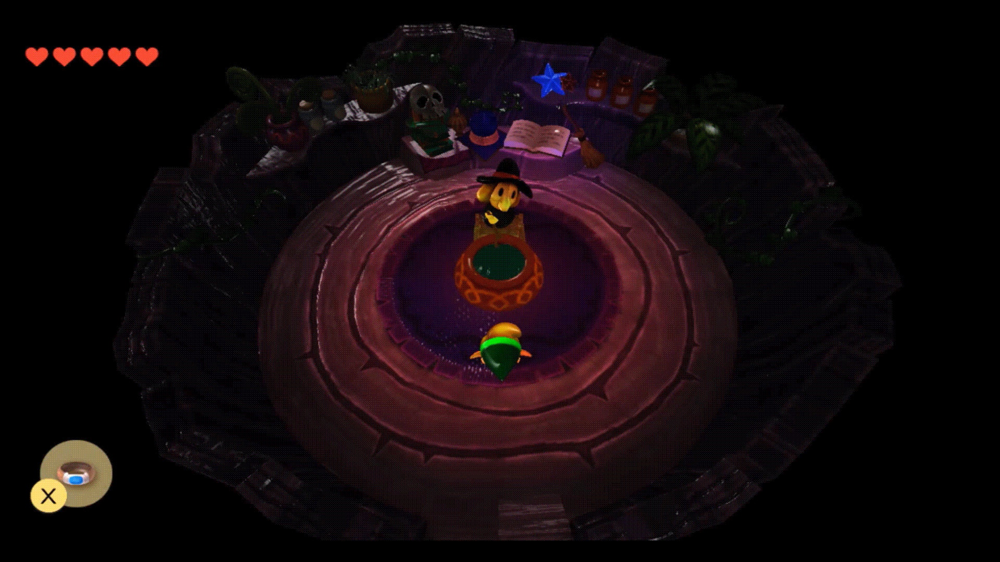

### 개요

Gameplay에서 발생하는 다양한 Effect를 공통 데이터와 Rendering 흐름으로 관리하기 위한 Effect System을 구현했습니다.

### 주요 내용

Effect 생성 위치, Scale, 회전, 색상과 Lifetime 등의 속성을 데이터로 관리하고, Gameplay에서는 필요한 Effect 정보만 전달하여 생성하도록 구성했습니다. Billboard Particle, Dissolve 등 HLSL 기반 Rendering 효과와 연동하여 공격, 상호작용 및 환경 연출에 사용할 수 있도록 구현했습니다.

---

# 🛠 Tool

## 1. 데이터 기반 MapTool 및 Editor 시스템

  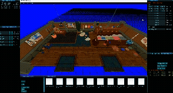

### 개요

Map, NPC, Interaction Object, Room 및 Navigation 데이터를 Client 코드 수정 없이 제작할 수 있도록 ImGui 기반 자체 MapTool을 구현했습니다.

### 주요 내용

Tool에서 Object 생성·삭제와 Transform 편집, NPC 및 Trigger 배치, Room과 Navigation 데이터를 제작할 수 있도록 구성했습니다. 제작된 데이터를 파일로 저장하고 Runtime에서 동일한 데이터 구조를 읽어 공간을 복원하여 콘텐츠 배치와 Client 코드를 분리했습니다.

---

## 2. Navigation & Cell System

  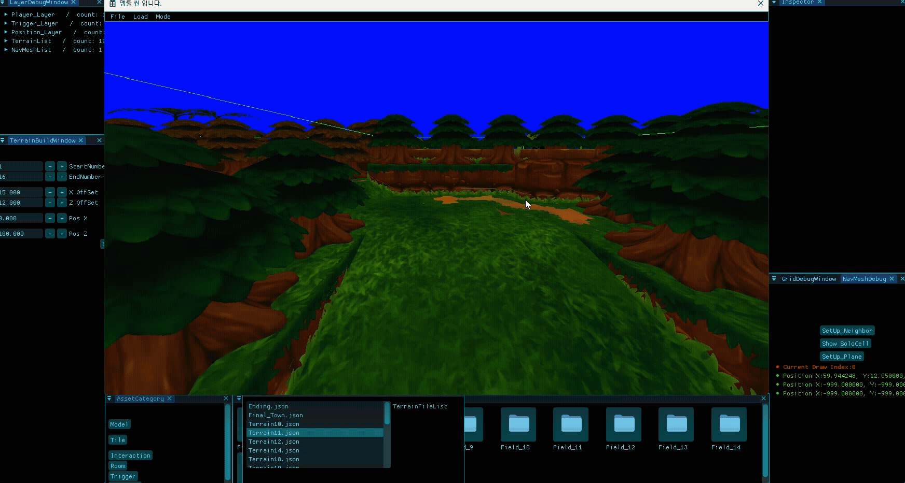

### 개요

삼각형 Cell 기반 Navigation 데이터를 이용하여 Player와 Monster의 이동 가능 영역과 지면 높이를 판정하는 시스템을 구현했습니다.

### 주요 내용

MapTool에서 Navigation Cell의 정점과 연결 정보를 제작·저장하고, Runtime에서는 현재 위치가 포함된 Cell과 인접 Cell 정보를 기준으로 이동 가능 여부를 판정하도록 구성했습니다. 동일한 Navigation 데이터를 Player 이동과 Monster AI에서 함께 활용하여 Tool에서 제작한 이동 영역이 실제 Gameplay에 그대로 반영되도록 구현했습니다.

---

# 🔧 추가 구현 기능

## Monster State / AI

**Idle, Detect, Attack, Damage, Dead 등 Monster의 행동을 상태 단위로 분리하고, Player 감지와 공격 조건에 따라 State를 전환하도록 구현했습니다.**

---

## Animation Notify

**Animation 재생 시점에 Notify를 등록하여 공격 판정, Effect 생성, 무기 위치 변경 등의 Gameplay Event를 Animation과 동기화하도록 구현했습니다.**

---

## FBX 모델 데이터 바이너리화

**외부 FBX 모델 데이터를 자체 엔진에서 사용할 수 있는 데이터로 변환하고 Binary 파일로 저장하여 Runtime에서 직접 로드할 수 있는 Resource Pipeline을 구현했습니다.**

---

## Client Debug

**Runtime에서 Level, Camera, Light, Object, State, Effect 정보를 직접 확인·수정하고 변경 결과를 즉시 검증할 수 있는 Debug 환경을 구현했습니다.**

---

## Collision System

**충돌 형상 계산과 GameObject의 충돌 상태 관리, 충돌 대상 선별을 분리하여 다양한 Gameplay Object에서 공통으로 사용할 수 있는 Collision 구조를 구현했습니다.**

---

# 💡 프로젝트 회고

자체 프레임워크 환경에서 첫 3D 액션 어드벤처 프로젝트를 완성하며 Gameplay 콘텐츠뿐만 아니라 게임 흐름을 관리하는 Framework와 콘텐츠 제작 Tool까지 직접 설계하고 연결하는 경험을 할 수 있었습니다. 특히 MapTool에서 제작한 데이터가 Runtime의 Navigation, Room, NPC 및 Interaction 시스템으로 이어지는 데이터 기반 콘텐츠 제작 흐름을 구현했습니다.

NPC Room 진입, UI Overlay, Loading처럼 기존 Level 상태를 유지한 채 다른 공간이나 화면으로 전환해야 하는 상황이 많아, 어떤 데이터를 유지하고 복귀 시 무엇을 다시 동기화할지 결정하는 과정이 어려웠습니다. 또한 하나의 Room을 전환할 때 Object뿐만 아니라 Player 위치, Navigation, Light와 Interaction 상태까지 함께 관리해야 했기 때문에 공간 전환을 하나의 상태 단위로 관리할 필요가 있었습니다.

이 과정에서 화면이나 공간 전환은 단순히 Scene을 교체하는 문제가 아니라 **기존 상태의 보존 범위와 다시 활성화할 때 복구해야 하는 데이터를 명확하게 정의하는 것이 중요하다는 점**을 배웠습니다. 또한 Tool과 Runtime을 함께 구현하며 데이터 기반 구조에서는 데이터를 외부로 분리하는 것뿐 아니라 **제작 단계의 데이터 구조와 이를 소비하는 Runtime 구조를 함께 설계해야 한다는 점**을 경험했습니다.

---

# 🔗 링크

- Notion : [기술 문서 바로가기](https://www.notion.so/5182e3fb387b8291bedc017d7a6afdfe?source=copy_link)
- YouTube : [게임플레이 영상](https://youtu.be/PB9gO-fBNdo)
